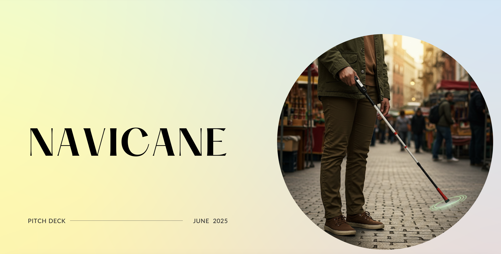

_<html lang="en">
<head>
  <meta charset="UTF-8">
  <meta name="viewport" content="width=device-width, initial-scale=1.0">
  <link rel="stylesheet" href="styles.css">
  <title> My Portfolio </title>
  
</head>
<body>
  <header>
    <nav>
    <h1 style="font-size: 4rem; color: #003459;">NEHA NEPAL</h1>
      <ul>
        <li><a href="#about">About Me</a></li> 
        <li><a href="#projects">Projects</a></li> 
        <li><a href="#contact">Contact</a></li>
        <li><a href= "#internship&prof">Internship & Professional Experience</a></li> 
        <li><a href= "#relevantcoursework">Relevant Coursework> 
      </ul>
    </nav>
  </header>
  <section id="about">
    <h2>About Me</h2>
     

  
  

    
Hi! My name is Neha Nepal, and I am a third-year Mechanical Engineering student at the University of California, Santa Barbara. I was born in Nepal and moved to the United States when I was seven years old. UCSB had been my dream school since my freshman year of high school, but by senior year, it became my third choice. Initially, I applied to most schools with plans to pursue aerospace engineering. However, after visiting UCSB, I realized it was the perfect fit for me and chose it over my other options. Because UCSB doesn’t offer an aerospace engineering program, I enrolled in Mechanical Engineering and have thrived in the program. Meeting peers with interests ranging from bioengineering to mechatronics has broadened my perspective and diversified my interests. While I remain passionate about aerospace engineering, my focus has expanded to include sustainable energy solutions and optimizing systems for energy efficiency within the field.   
  

</section>

  <section id="projects">
  <h2>Projects</h2>

  

    <h3>Automatic Window Washer</h3>
    

      
    

    

      This project began as a concept to eliminate the safety risks faced by human window washers working on skyscrapers. However, after researching existing commercial solutions, we shifted focus to create a more practical and impactful product: an automated window washing system for residential homes. The goal was to design a permanent, cost-effective system that could be installed once and save homeowners thousands of dollars in window cleaning services over time.
    

    

      Our final design utilized a T-bar gantry mechanism, driven by a stepper motor and motor driver, to move the cleaning module across the window’s surface both horizontally and vertically. We developed multiple iterations of the wiper and rail system, using CAD modeling (SolidWorks) and 3D-printed prototypes to test and refine functionality.
    

    

      My primary role was leading the design of the fluid dispensing system. This involved:
    

    <ul>
      <li>Calculating the required flow rate and nozzle pressure for effective coverage.</li>
      <li>Analyzing head loss through the tubing to select an appropriate pump.</li>
      <li>Integrating the fluid system with the motion system to ensure synchronized cleaning action.</li>
    </ul>
    

      One of the major challenges was balancing compactness with mechanical stability, particularly as we scaled down the design for residential window sizes. The team iterated on bracket designs, friction reduction techniques, and water flow control to optimize performance.
    

    

      We presented our working physical prototype at the UCSB Junior Design Fair, where we demonstrated the engineering process and final product to peers, faculty, and industry professionals. The project showcased not only our technical capabilities, but also our ability to adapt the problem scope based on research and market viability.
    

    
<a href="x.png">Project Poster</a>

    
<a href="New_ME_153_final_project (2) (2).pdf">Project Report</a>

    
<a href="Safe Operating Procedure.pdf">Safe Operating Procedure</a>

  

  

    <h3>Airfoil Optimization</h3>
    

      
    

    

      As part of a three-person team, I led the mechanical analysis and modeling of a horizontal-axis wind turbine blade optimized for 12 m/s rated wind speed. We used the S8037 airfoil to design a four-blade rotor system with a 50-meter diameter and a tip speed ratio of 6.
    

    <ul>
      <li>Used MATLAB to perform aerodynamic calculations, including Reynolds number estimation, chord and pitch optimization, and axial induction factor distribution.</li>
      <li>Developed and integrated Blade Element Momentum (BEM) theory to calculate power, torque, and thrust coefficients, validating convergence through iterative modeling.</li>
      <li>Designed and refined the 3D turbine blade in SolidWorks, then scaled the model for physical stress testing under different material and wind conditions.</li>
      <li>Conducted simulations to determine critical deflection wind speed and root bending moment, using ABS plastic as a scale model material.</li>
      <li>Modeled turbine wake behavior using Park, Revised Park, and Entrainment models to assess array performance for a 10-turbine farm layout.</li>
    </ul>
    

      This project strengthened my fluency in aerodynamic modeling and mechanical simulation, and deepened my interest in sustainable power generation and energy system optimization.
    

    
<a href="Wind_and_Tidal_Project (5) (2).pdf">Project Report</a>

  

  

    <h3>Coding Projects (MATLAB and Python)</h3>
    

      
    

    

      The Billiard Simulation Project simulates the motion and collision dynamics of two balls (one blue and one red) in a confined space using MATLAB. The simulation takes into account various forces, including gravity, drag, and friction, to model the motion of the balls. It calculates the velocities, positions, and collision responses of the balls when they hit walls or each other, accounting for energy loss due to damping and friction.
    

    

      I developed the collision detection and velocity response system using physics-based algorithms, ensuring that both energy loss and momentum conservation were accounted for.
    

    
<a href="billiard__Copy_.pdf">Project Report</a>

    
<a href="Untitled.mov">Simulation Video</a>

  

  

    <h3>Rep Counter</h3>
    

      For my design class, I maintained a comprehensive record of all my projects, including drawings, sketches, invention ideas, circuitry, SolidWorks designs, and the final project. The final project, which won the "Most Technical Project" award in the class, is showcased on pages 31–38 of the design portfolio, accompanied by a working video demonstration.
    

    
<a href="Final Project.mp4">Project Video</a>

    
<a href="DESIGN PORTFOLIO.pdf">Design Notebook</a>

  

  

    <h3>Air Motor</h3>
    

      
    

    

      In this project, I designed and built a fully operational air motor, utilizing a range of machining tools and techniques. I operated band saws for cutting raw stock and used Haas vertical mills to precisely cut and drill key motor components. Additionally, I demonstrated machining proficiency by working with lathes to shape, sand, and drill spherical components.
    

    

      After assembly, I achieved an air motor speed of 2800 RPM, surpassing the expected performance by 400 RPM. I conducted thorough performance tests to ensure the motor met all design specifications and ran efficiently. Throughout the project, I documented the process, including design iterations and troubleshooting, providing a comprehensive record of the build.
    

  

  

    <h3>NaviCane</h3>
    

      
    

    

      As part of a technology management course, I pitched an original venture idea to a class of 50 students. Out of all proposals, mine was one of six selected to move forward, positioning me as the CEO of our mock company. I wanted the venture to reflect both my engineering background and a cause I cared deeply about: improving assistive mobility for the blind.
    

    

      I conducted extensive research by interviewing professors in assistive tech, a blind faculty member, engineering students working on similar concepts, and staff at the Braille Institute of Santa Barbara. Their insights guided the product evolution—from an interactive vest to a more viable and user-friendly interactive cane.
    

    

      I led the development of our business plan, drafted team contracts, organized regular meetings, and delivered multiple progress pitches. As project lead, I was responsible for setting direction, resolving conflicts, and holding the team accountable.
    

    

      The project was a success, earning top marks on all deliverables and solidifying my passion for applying engineering to socially impactful challenges.
    

    
<a href="Business Plan.docx (1).pdf">Business Plan</a>

    
<a href="Real Navicane.pdf">Pitch Deck</a>

  

</section>

<section id="internship&prof">
  <h2>Internship & Professional Experience</h2>

  

    <h3>Western Allied Mechanical – Project Engineering Intern</h3>
    

      
    

    
With a strong interest in heat transfer and fluid dynamics, I sought out an internship that would allow me to apply these concepts in real-world settings. While I had initially leaned toward aerospace engineering, a conversation with an HVAC professional helped me realize that the HVAC industry offered many of the same technical challenges—especially in airflow, energy systems, and thermal control—within a practical and fast-paced environment.

    
As a Project Engineering Intern at Western Allied Mechanical, I supported over ten active HVAC projects, primarily in high-stakes environments such as hospitals and laboratories. This experience gave me insight into both the engineering and business aspects of project delivery, and it clarified my passion for the technical side of engineering.

    <ul>
      <li>Assisted in reviewing and redlining mechanical plans, saving the project team over 30 hours/week by identifying early discrepancies and clarifying installation requirements.</li>
      <li>Conducted weekly job site audits on projects valued between $2–3 million, checking for compliance with mechanical specs, code, and installation quality.</li>
      <li>Collaborated with engineers to redesign and recreate mechanical drawings, preventing an estimated $50,000 in potential rework due to coordination clashes or design gaps.</li>
      <li>Streamlined processes for RFIs (Requests for Information) and submittals, and managed procurement logs, helping maintain on-time material delivery and project alignment.</li>
    </ul>

    
Throughout the internship, I found myself drawn to understanding how the systems worked—from airflow routing to energy efficiency design choices. While I appreciated the exposure to business and management, it was the mechanical problem-solving that confirmed my desire to pursue a career grounded in engineering fundamentals.

  

  

    <h3>Target – Guest Advocate</h3>
    

      
    

    
Although I only worked at Target for two months, it was a valuable job that introduced me to the importance of self-management in a solo work environment. I was responsible for independently operating my cash register, assisting customers, managing my breaks, and maintaining punctuality—all without direct supervision. This experience taught me a great deal about accountability and reliability.

    
I maintained perfect register accuracy throughout my time there, with no discrepancies or concerns raised by management. Initially I had chosen to work there because I knew it would be easier for me to get hired at a Target near UCSB if I had previously worked there, but ultimately I chose to focus on my transition into college. The role, however, laid a strong foundation for my work ethic and time management skills.

  

  

    <h3>Panda Express – Person In Charge / Front of House</h3>
    

      
    

    
I began working at Panda Express during my junior year of high school, and over the course of nine months, I progressed from a Front of House assistant to being promoted to Person in Charge—a role typically held by older, more experienced staff.

    
Starting with basic responsibilities like taking orders, I quickly gained the trust of management and took on greater responsibilities, including closing the store independently, handling end-of-day finances, leading the closing team, supporting kitchen operations, and holding team members accountable for register discrepancies.

    
I earned two raises during my time there, reflecting my strong work ethic and leadership. I eventually chose to leave the position to focus on AP exams and completing my senior year, but the experience gave me a deep appreciation for teamwork, accountability, and growth in a fast-paced environment.

  

</section>

  <section id="contact">
    <h2>Contact</h2>
    
<a href="mailto:nepalneha1@gmail.com">nepalneha1@gmail.com</a>

    
<a href="www.linkedin.com/in/nehanepal/" target="_blank">My LinkedIn Profile</a>

  </section>
</section>
  <footer>
    
&copy; 2023 Neha Nepal. All rights reserved.

  </footer>
_
